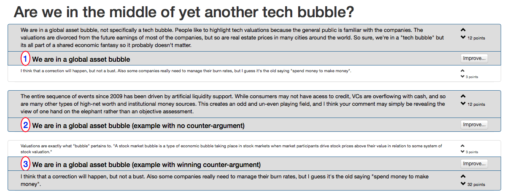

# arguably: make online discussions suck less

Help me make online discussions suck less.

## Ideas and Insights

Discussing general topics (politics, social, think sites like reddit) is not a good experience. Focused questions with one definitive answer work much better (think StackOverflow, Wikipedia).

How do we bring "answers worth saving" to general discussions? So far, online forums rely on threaded answers with some voting, that's it. Can we do better?

Key ideas:

* multiple top comments are ok, there is no one right answer
* comments should be improved by the community, not one single contributor can write the best comment on first attempt, others need to help (similar to wikipedia, without the hassle) 

Most of the visitors are casual readers (lurkers). For them, the value is in quickly seeing the best top comments so they can make up their own mind. They also like to vote for the comments they like most.

A small percentage of visitors write and argue online.

## Mockup

After one iteration of brainstorming, here are the new specs:

* show the top-10 "why" and "why not" comments, which should fit pretty much on one page for most systems (definitely for desktop/laptops, maybe not quite so for phones)
* if you click on one of the top-10 items, a new full-screen page appears that shows you the different versions of arguments that people used, so you can edit, improve or upvote

Basically, rely on those two "full-screen" views for everything. The top-10 view is meant to be the reference page for that topic, that Google would index and shows the high-quality answers that people are looking for. The "improve" view is where contributors do the nitty-gritty of working out what should be great content.

This is what the top-10 page would look like:

The (ugly) mockup below shows how arguments and counter-arguments are grouped together, and how the winning argument is displayed with a bigger font in bold, while the losing argument uses a smaller font and italics. I'm sure this can be designed better...

    <title>are we in a tech bubble yet?</title>

    <h1>#1</h1>
    
argument for why we are in a bubble, received more votes than the counter-argument so it's winning

    
counter-argument for why we are in a bubble, received fewer votes than the argument above, so it's displayed less prominently

    <h1>#2</h1>
    
another argument for why we are in a bubble, interestingly, is not winning compared to the counter-argument below, though we always would display why argument first

    
counter-argument for why we are in a bubble, voted more than the original argument, so must be displayed promonently

There is a "work in progress" HTML/CSS 

A feature would be to have a title for each argument/counter-argument, or allow each argument to highlight (bold and large font) a few words, so people can quickly get the gist of the argument. It's not just cosmetic: it would also help guide the counter-argument, so you know better what you are providing a counter-point for.

## How you can help

I'm interested in all ideas, feedback and comments to make this work.

There are so many possibilities and choice to be made. You can help! Shoot me an email. Criticisms welcome as well ("this will never work because...").

I'm not good at CSS, so if someone can contribute a really basic template that covers the top-10 screen, that would be awesome.
