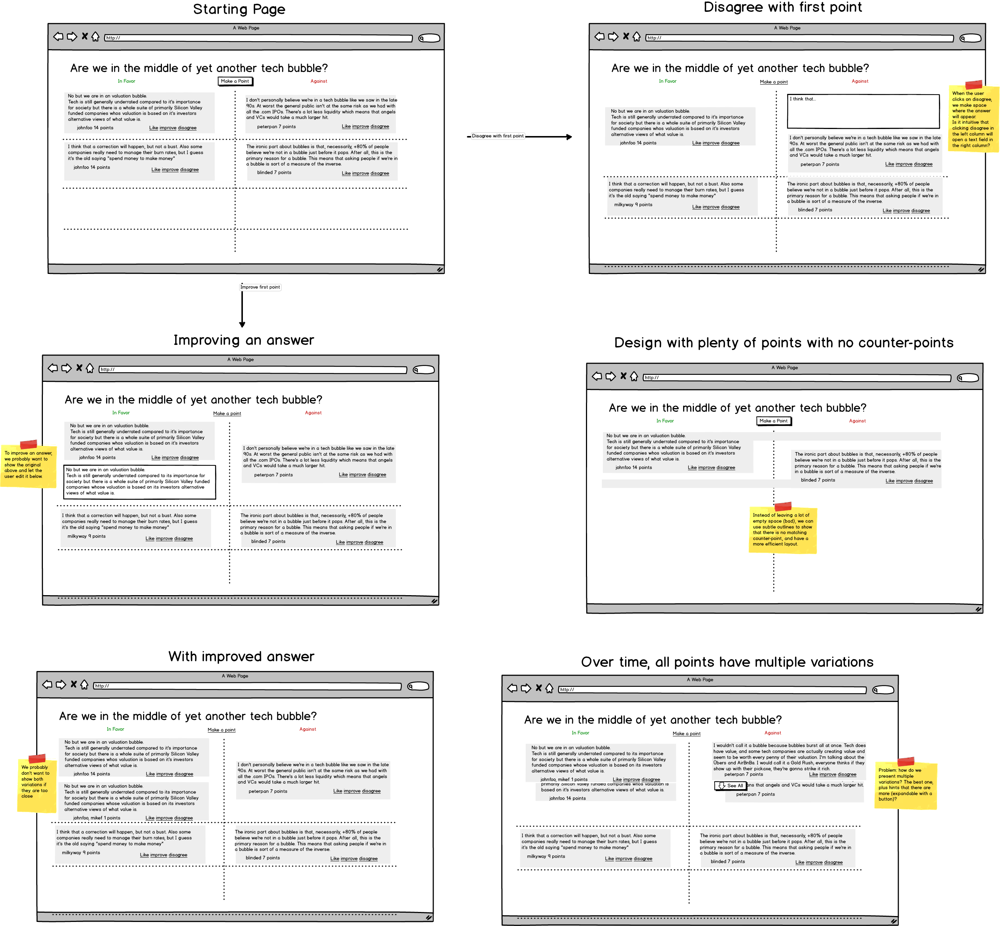

# arguably: make online discussions suck less

Help me make online discussions suck less.

## Ideas and Insights

Discussing general topics (politics, social, think sites like reddit) is not a good experience. Focused questions with one definitive answer work much better (think StackOverflow, Wikipedia).

How do we bring "answers worth saving" to general discussions? So far, online forums rely on threaded answers with some voting, that's it. Can we do better?

Key ideas:

* multiple top comments are ok, there is no one right answer
* comments should be improved by the community, not one single contributor can write the best comment on first attempt, others need to help (similar to wikipedia) 

Most of the visitors are casual readers (lurkers). For them, the value is in quickly seeing the best top comments so they can make up their own mind. They also like to vote for the comments they like most.

A small percentage of visitors write and argue online.

## How you can help

I'm interested in all ideas, feedback and comments to make this work. See the Balsamiq mockup below to get a better idea of what I have in mind, and then send comments!

The original idea was to have 3 columns, so the top 3 comments would be shown. This was potentially great for gamification: you'd definitely want your comment to make it to one of the top 3. On the other hand, it may have been confusing. So instead, I'm exploring the idea of a more binary choice: for and against the topic. Pick a side.

In that format, there are two columns, and each column will have the best arguments (by vote) listed on top. There is no nested or threaded discussion. Really, there is just one level of threading, implicitly: you can "disagree" with an argument, which lets you enter your own argument opposite the one you disagree with.

A key challenge is to motivate people to improve on other people's arguments, rather than write their own. So you can edit anyone's argument to make it better (votes should be able to tell us whether you succeeded or not). Editors should be credited together with the original author of an argument.

We'll probably add the capability to add short comments to either side of the discussion, similar to what StackOverflow is doing. But they should not be the main point of focus.

